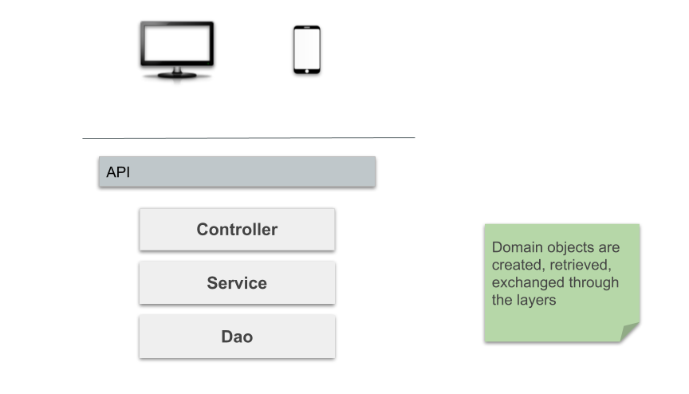

# Music Back-End
This is the repository for the backend of the music catalog. 
It is a Spring Boot application with a dead simple data model:

## Data Model
The data model is a simple structure in which an ```Artist``` can have many ```Albums``` many ```Tracks``` belong to one ```Album```. A more realistic model might model many-to-many relationships instead so that tracks can be associated to more than one artist and multiple artists can collaborate on one album

### Data Model Diagram

___

## Application
The application is a Spring Boot system using Jpa crud repositories. Controllers are the api-facing element and are serviced by the ```Services`` which extract data from the H2 in memory database
### Architecture Diagram


